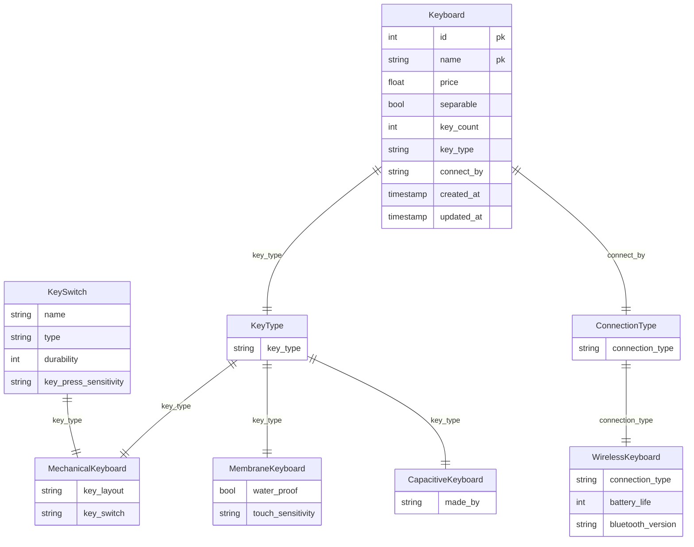

```mermaid
erDiagram

    Keyboard ||--|| KeyType: key_type
    Keyboard ||--|| ConnectionType: connect_by
    ConnectionType ||--|| WirelessKeyboard: connection_type
    KeySwitch ||--|| MechanicalKeyboard: key_type
    KeyType ||--|| MechanicalKeyboard: key_type
    KeyType ||--|| MembraneKeyboard: key_type
    KeyType ||--|| CapacitiveKeyboard: key_type

    Keyboard {
        int id pk
        string name pk
        float price
        bool separable
        int key_count
        string key_type
        string connect_by
        timestamp created_at
        timestamp updated_at
    }

    KeySwitch {
        string name
        string type
        int durability
        string key_press_sensitivity
    }

    KeyType {
        string key_type
    }

    MechanicalKeyboard {
        string key_layout
        string key_switch
    }

    MembraneKeyboard {
        bool water_proof
        string touch_sensitivity
    }

    CapacitiveKeyboard {
        string made_by
    }

    ConnectionType {
        string connection_type
    }

    WirelessKeyboard {
        string connection_type
        int battery_life
        string bluetooth_version
    }


```
