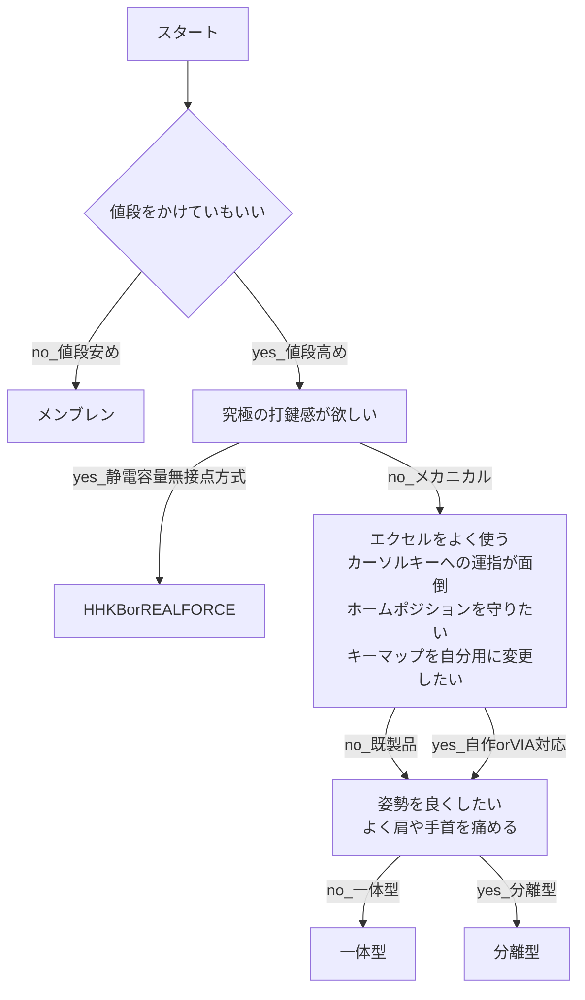

```mermaid
flowchart TD

    START[スタート] --> PRICE{値段をかけていもいい}
    PRICE -->|no_値段安め|MEM[メンブレン]
    PRICE -->|yes_値段高め|KEY_TOUCH[究極の打鍵感が欲しい]
    KEY_TOUCH -->|yes_静電容量無接点方式|HHKBorREALFORCE
    KEY_TOUCH -->|no_メカニカル|MECHANICAL[エクセルをよく使う<br/>カーソルキーへの運指が面倒<br/>ホームポジションを守りたい<br/>キーマップを自分用に変更したい]
    MECHANICAL -->|no_既製品|PROGRAMABLE[姿勢を良くしたい<br/>よく肩や手首を痛める]
    MECHANICAL -->|yes_自作orVIA対応|PROGRAMABLE
    PROGRAMABLE -->|no_一体型|NOT_SEPARATE[一体型]
    PROGRAMABLE -->|yes_分離型|SEPARATE[分離型]


```

    質問一覧
    ・値段　メンブレンorその他
    ・打鍵感　メカニカルor静電容量
    ・エクセルをよく使う 自作or既製（キーマップのプログラマブル）
    ・肩や手首を痛めがち 一体型or分離
    おまけ
    ・コーヒー体の前におきたい 一体型or分離
    ・記号をよく使う key数
